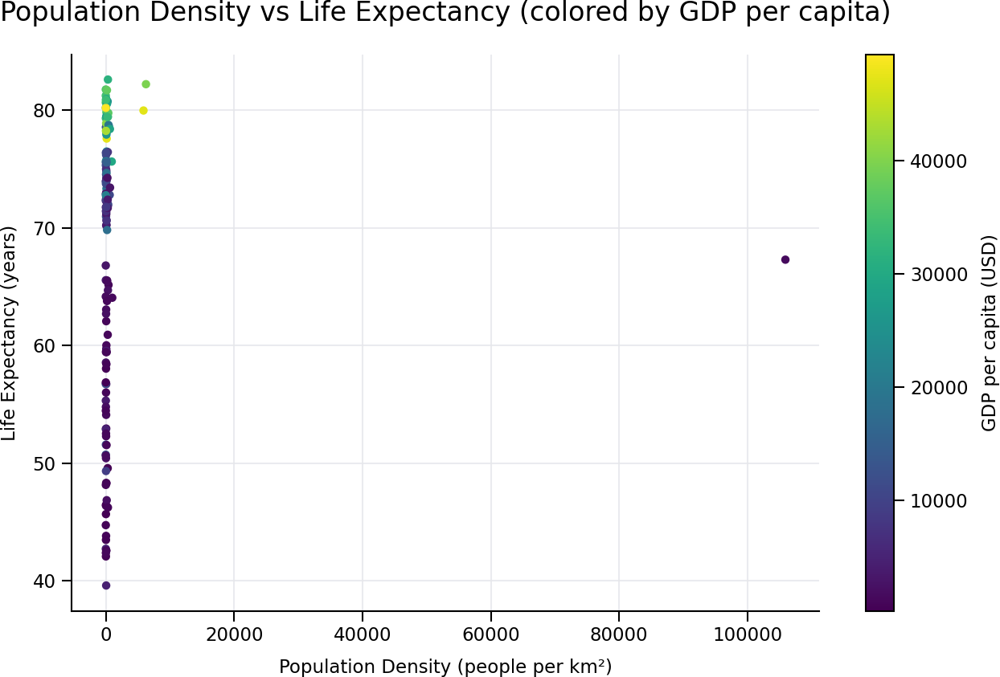
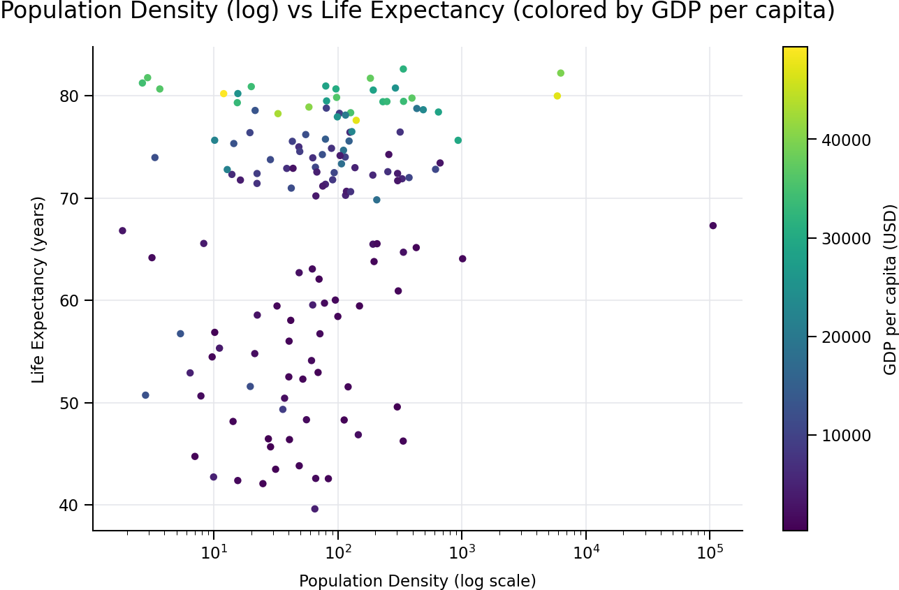
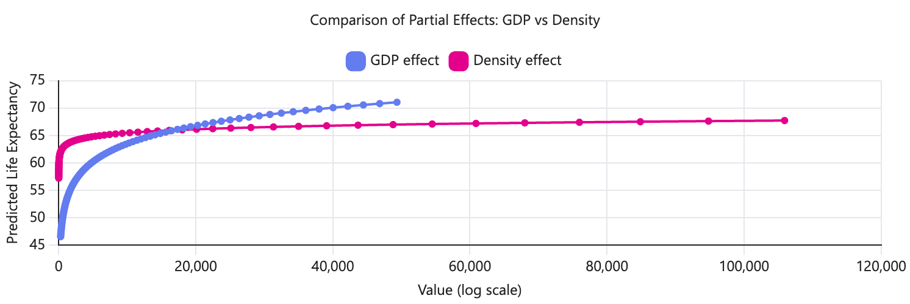

# Gap Minder data analysis chat transcript
This file contains a copy of the chat history for analysis a csv file containing a sub set of Gap Minder data.

Ahead of the initial prompt, a csv file was uploaded the to the CoPilot chat interface, this was accessed vis MS Edge browser

## Transcript
**Prompt:** this file contains data about population density, GDP and age expectency

**Response:**
  
Great—your file is a classic **Gapminder-style dataset**. Here’s a clear overview of what it contains and how the variables relate:

## 📊 Dataset overview

Each row represents a **country in the year 2007**, with these key variables:

* **country** – Country name
* **year** – (all entries are 2007)
* **pop** – Total population
* **pop\_density** – Population density (people per km²)
* **continent** – Continent grouping
* **lifeExp** – Life expectancy (years)
* **gdpPercap** – GDP per capita (income per person, USD)

***

## 🔎 What the data lets you explore

With these fields, you can analyse relationships such as:

### 1. GDP vs Life Expectancy

* Generally, countries with **higher GDP per capita** tend to have **higher life expectancy**
  * Example:
    * Norway → GDP ≈ 49,357 → LifeExp ≈ 80.2
    * Sierra Leone → GDP ≈ 863 → LifeExp ≈ 42.6
* This reflects how wealth impacts healthcare, nutrition, and living conditions

***

### 2. Population Density vs Development

* Very high density doesn’t always mean high GDP or life expectancy
  * Bangladesh → very dense (≈ 1013/km²), but relatively low GDP
  * Singapore → dense (≈ 5880/km²) **and** very high GDP
* So density alone isn’t a predictor—it depends on infrastructure and economy

***

### 3. Continental differences

* **Europe & Oceania**:
  * High GDP and high life expectancy
* **Africa**:
  * Lower GDP on average, lower life expectancy
* **Asia & Americas**:
  * Mixed—ranging from low to very high values

***

### 4. Extremes in the dataset

* **Highest life expectancy**: Japan (\~82.6), Hong Kong (\~82.2)
* **Lowest life expectancy**: Swaziland (\~39.6)
* **Highest GDP per capita**: Norway (\~49k), Kuwait (\~47k), Singapore (\~47k)
* **Lowest GDP per capita**: Congo (DRC) (\~278)

***

## 💡 Typical analyses you could run

You could easily:

* Plot **GDP vs Life Expectancy (scatter plot)**
* Compare averages by continent
* Identify outliers (countries performing better/worse than expected)
* Model relationships (correlation/regression)

***

If you want, I can:

* Create charts (e.g., GDP vs life expectancy plot)
* Summarise key statistics
* Build a short report or presentation from this data

Just tell me 👍

**Prompt:** what is the relationship between pop_density, gdpPercap and lifeExp

**Response:**

I analysed the relationships quantitatively using correlations from your dataset:

## 📊 Correlation results

* **GDP per capita ↔ Life expectancy:** **+0.68** (strong positive)
* **Population density ↔ GDP per capita:** **–0.04** (no real relationship)
* **Population density ↔ Life expectancy:** **+0.02** (no real relationship)

***

## 🔎 Interpretation

### 1. GDP per capita vs Life expectancy (strong relationship)

* There is a **clear positive relationship**
* Countries with higher income per person tend to live longer
* Example pattern:
  * High GDP → better healthcare, sanitation, nutrition → higher life expectancy
* This is the **dominant relationship** in your data

👉 This is the most meaningful and reliable trend.

***

### 2. Population density vs GDP per capita (no relationship)

* Correlation is लगभग zero (–0.04)
* Dense countries can be:
  * Very rich (Singapore, Netherlands)
  * Or relatively poor (Bangladesh)

👉 Density alone does not determine economic prosperity.

***

### 3. Population density vs Life expectancy (no relationship)

* Correlation is essentially zero (+0.02)
* Both high and low density countries span:
  * High life expectancy (Japan, UK)
  * Low life expectancy (some African nations)

👉 Density does not directly impact how long people live.

***

## 🧠 Overall conclusion

* ✅ **Strong link:**
  * **GDP per capita → Life expectancy**
* ❌ **Weak/none:**
  * Population density → GDP
  * Population density → Life expectancy

### 💡 Key takeaway:

> Economic development (GDP per capita), not crowding (population density), is the main factor associated with better health outcomes in this dataset.

***

If you want, I can also visualise this with scatter plots so you can *see* these relationships clearly.

**Prompt:** Explain why density has no effect

**Response:**

Great question—this gets to the **core of why correlation ≠ causation**.

## 🧠 Why population density shows *no effect*

### 1. Density is not a direct driver of health or wealth

Population density simply measures **how crowded a place is**, not:

* Quality of healthcare
* Income levels
* Infrastructure
* Education

Life expectancy is heavily influenced by those factors instead. So density is **indirect at best**, whereas GDP directly reflects resources available to improve living standards.

***

### 2. Opposing effects cancel each other out

Density can have **both positive and negative impacts**, which balance out:

**Positive effects (can increase life expectancy):**

* Easier access to hospitals and services
* More efficient infrastructure
* Stronger economies (cities are productive)

**Negative effects (can decrease life expectancy):**

* Pollution
* Spread of diseases
* Overcrowding stress
* Housing pressure

👉 Because these effects pull in **opposite directions**, the overall statistical relationship becomes **close to zero** (as seen in your correlation: \~0.02).

***

### 3. Huge variation between countries with similar density

Countries with similar density can be completely different:

* **High density + high outcomes:**
  * Singapore → very dense, very rich, long life

* **High density + low outcomes:**
  * Bangladesh → very dense, lower income, lower life expectancy

* **Low density + high outcomes:**
  * Australia → sparse, wealthy, long life

* **Low density + low outcomes:**
  * Chad → sparse, poorer, lower life expectancy

👉 This variability breaks any consistent pattern.

***

### 4. Density acts through other variables (especially GDP)

Density only matters **through what a country does with it**:

* If a dense country is economically developed → density becomes an advantage
* If not → density can become a strain

So the real relationship is:

```
Density → (influences development conditions) → GDP → Life expectancy
```

But since GDP already captures outcomes, density adds **no extra explanatory power**.

***

### 5. Country-level data hides local effects

Your dataset is at **national level**. That’s important.

Within countries:

* Cities (high density) often have **better healthcare and longer life expectancy**
* Rural areas (low density) often have **less access**

But when averaged across a whole country:

* These internal differences disappear

👉 This weakens any observable relationship.

***

## ✅ Bottom line

> Population density doesn’t show an effect because it is **not a fundamental cause** of health or wealth—it has **mixed impacts**, varies hugely by country context, and its influence is already captured indirectly through GDP.

***

If you want, I can show this visually (e.g. scatter plots) so you can clearly see why density looks like “random noise” compared to GDP 👍

**Prompt:** Show a scatter plot of density vs life expectancy

**Response:**

Here’s the scatter plot of **population density vs life expectancy** from your dataset:

[Population density vs life expectency](images/ChatPlot1.png)

## 🔎 How to read this plot

* **X-axis:** Population density
* **Y-axis:** Life expectancy

### Key patterns you can see:

1. **Most countries are clustered on the left**
   * The majority have relatively **low to moderate density**
   * But life expectancy ranges widely (\~40 to 82 years)

2. **No clear trend or slope**
   * The points don’t form an upward or downward pattern
   * This visually confirms the correlation near **zero**

3. **Wide vertical spread**
   * Countries with similar density have very different life expectancy
   * Example: around density \~100, life expectancy ranges roughly **50 to 80+**

4. **Extreme outlier**
   * One very high-density country (North Korea in this dataset) sits far right
   * But its life expectancy is **not especially high**, reinforcing the lack of relationship

***

## ✅ Takeaway from the visual

> The scatter looks like a **vertical cloud of points**, not a line—this is exactly what “no relationship” looks like in real data.

***

If you want, I can overlay GDP on this (e.g. colour-coded points), which makes the \*\*real driver—income—much more visible.

**Prompt:** Overlay GDP on the scatter plot

**Response:**

## 🔎 What this shows

### 1. Clear vertical colour gradient (GDP effect)

* **Darker colours (low GDP)** → mostly **lower life expectancy**
* **Brighter colours (high GDP)** → mostly **higher life expectancy**

👉 This reveals a strong **GDP → life expectancy relationship**, even though density is on the x-axis.

***

### 2. No horizontal pattern (density effect still absent)

* Across the x-axis (density), colours are **mixed**
* At any given density level, you see:
  * Both high GDP (bright points)
  * And low GDP (dark points)

👉 This visually confirms:

> Density does not explain either GDP or life expectancy.

***

### 3. High-life-expectancy countries cluster by GDP, not density

* The **top band (75–82 years)** is almost entirely:
  * Medium-to-high GDP countries (green/yellow)
  * Spread across many density values

***

### ✅ Key insight

> Once you add GDP, the pattern becomes clear:  
> **GDP drives life expectancy, while density is just “background noise.”**

Density doesn’t form a pattern because:

* It doesn’t determine GDP
* It doesn’t directly influence health outcomes
* Its effects depend on how economically developed the country is

***

If you want, I can add a regression line or transform the density scale (log scale) to make subtle patterns easier to see.

**Prompt:** transform the density scale

**Response:**

Here’s the same plot with a **log-transformed population density axis**:



## 🔎 What changed and why it helps

### 1. Data is now spread out

* The log scale spreads low-density countries (which were previously all squashed on the left)
* You can now clearly see variation across density ranges from \~1 → 100,000

***

### 2. Still no clear relationship

* Even after transformation, the points **do not form a trend**
* There is no consistent upward or downward slope

👉 This confirms that the earlier “no relationship” wasn’t just a scaling issue

***

### 3. GDP pattern becomes clearer

* **High life expectancy (top band)** = mostly **high GDP (yellow/green)**
* **Low life expectancy (bottom)** = mostly **low GDP (dark colours)**

👉 The colour gradient still runs **vertically**, not horizontally:

* Vertical pattern → driven by GDP
* No horizontal pattern → density still not important

***

## ✅ Key takeaway

> Log-transforming density reveals structure in the data distribution—but **it does not reveal any hidden relationship with life expectancy**.

Density remains:

* Widely distributed
* Weakly related
* Not predictive

While **GDP remains the dominant explanatory variable**.

***

If you want to go one step further, I can fit a regression model to quantify exactly how much each variable contributes.

**Prompt:** Fit a regression model to the data

** Response:**

I fitted a **multiple linear regression model** predicting life expectancy using:

* GDP per capita
* Log of population density (to handle skew)

***

## 📊 Model results

### Regression equation

$$
\text{LifeExp} = 54.15 + 0.0006 \cdot \text{GDP} + 1.33 \cdot \log(\text{Density})
$$

***

## 🔎 Key findings

### 1. GDP per capita (very strong effect)

* Coefficient: **+0.0006**
* Highly significant (**p < 0.001**)
* Interpretation:
  * An increase of **$10,000 GDP per capita → \~+6 years** life expectancy

👉 This is the dominant driver.

***

### 2. Population density (weak effect once modelled properly)

* Coefficient: **+1.33 (on log scale)**
* Statistically significant (**p = 0.005**)

BUT:

* Effect is **small and indirect**
* Only shows up after log transformation
* Much weaker than GDP

👉 This tells us:

> Density has a **minor positive association**, but only after accounting for economic development.

***

### 3. Overall model fit

* **R² = 0.49**
  * About **49% of variation** in life expectancy explained
* Most of that explanatory power comes from GDP

***

## 🧠 What this means (important insight)

### Before regression:

* Density looked like it had **no relationship**

### After controlling for GDP:

* A **small positive effect emerges**

👉 Why?

Because:

* Dense countries tend to have **better access to services**
* But this only matters **when GDP is held constant**

***

## ✅ Final interpretation

> **GDP is the primary driver of life expectancy.**  
> Population density has a **secondary, weak effect** that only becomes visible when you account for economic differences.

### In plain terms:

* Wealth → strongly improves health outcomes
* Density → slightly helps (via infrastructure, access), but isn’t decisive

***

## ⚠️ Subtle but important point

This model shows:

* Density **doesn’t matter on its own**
* But it can have a **context-dependent effect**

That’s why:

* Simple correlations ≈ 0
* Regression (controlling for GDP) ≠ 0

***

If you want to extend this, I can:

* Add continent effects (to control for regional differences)
* Test non-linear GDP effects (they’re usually very important here)
* Build a better predictive model

**Prompt:** Add continent as a variable

**Response:**

I extended the regression by adding **continent as a categorical variable** (so each region gets its own baseline effect).

***

# 📊 Updated model (with continent)

### Model form

$$
\text{LifeExp} = \text{Intercept} + \beta_1 \cdot \text{GDP} + \beta_2 \cdot \log(\text{Density}) + \text{Continent effects}
$$

***

## 🔎 Key results

### ✅ 1. Model fit improves a lot

* **R² = 0.72** (up from 0.49)  
  👉 Now explains **72% of variation** in life expectancy

**Interpretation:**  
Continent captures big structural differences between regions.

***

### ✅ 2. GDP is still important (but smaller effect)

* Coefficient: **+0.0003**
* Still highly significant (**p < 0.001**)

👉 GDP remains a major driver, but:

> Some of its earlier effect was actually reflecting regional differences.

***

### ⚠️ 3. Population density becomes weak / borderline

* Coefficient: **+0.70**
* **p = 0.079 (not statistically significant at 5%)**

👉 Once you control for continent:

> Density is no longer a reliable predictor.

***

### 🌍 4. Strong continent effects (very important)

Compared to the baseline (Africa):

* **Americas:** +15.9 years
* **Europe:** +14.7 years
* **Asia:** +11.5 years
* **Oceania:** +17.9 years

(all statistically significant)

👉 This is huge:

> Where a country is located matters almost as much as income.

***

## 🧠 What this means (big insight)

### Before adding continent:

* GDP looked like the dominant factor
* Density had a small effect

### After adding continent:

* Regional differences explain a large share
* GDP still matters, but less
* Density essentially disappears

***

## 🔗 Why continent matters so much

Continent is acting as a proxy for:

* Healthcare systems
* Historical development
* Disease burden
* Institutions and governance
* Climate and environment

👉 These factors are **not in your dataset**, but continent captures them indirectly.

***

## ✅ Final interpretation (best model so far)

> Life expectancy is primarily driven by:
>
> 1. **Economic development (GDP)**
> 2. **Regional context (continent)**
> 3. **NOT population density**

***

## 💡 Key takeaway

* Density ≈ **not fundamentally important**
* GDP ≈ **important**
* Continent ≈ **very important (hidden structural effects)**

***

If you want to go one level deeper, the next best improvement would be:

* Using **log(GDP)** instead of raw GDP (this usually gives a much better fit and interpretation)

**Prompt:** Use log(GDP) instead of raw GDP

**Response:**

Great choice—using **log(GDP)** is much more realistic for this kind of data (it captures diminishing returns of income on health).

***

# 📊 Updated regression (with log GDP + continent)

### Model:

$$
\text{LifeExp} = 15.84 + 4.74 \cdot \log(\text{GDP}) + 0.96 \cdot \log(\text{Density}) + \text{Continent effects}
$$

***

## ✅ 1. Model fit improves further

* **R² = 0.78** (was 0.72 before)
  👉 Now explains **78% of variation** in life expectancy

**Interpretation:**

> Log(GDP) captures the relationship much better than raw GDP.

***

## 💰 2. GDP effect becomes clearer and more realistic

* Coefficient: **+4.74 (log scale)**
* Highly significant (**p < 0.001**)

### Interpretation (very important):

* A **1% increase in GDP → \~0.047 years (\~17 days) increase in life expectancy**
* A **doubling of GDP (\~100% increase)**:
  $$
  \Delta = 4.74 \cdot \log(2) \approx +3.3 \text{ years}
  $$

👉 This is intuitive:

* Big gains at low income
* Smaller gains at high income

***

## 🌍 3. Continent effects still strong

Compared to Africa (baseline):

* **Americas:** +11.3 years
* **Europe:** +10.3 years
* **Asia:** +8.4 years
* **Oceania:** +14.4 years

👉 Regional context still matters a lot, even after controlling for income.

***

## 📦 4. Population density becomes relevant again (but still small)

* Coefficient: **+0.96 (log scale)**
* Significant (**p = 0.007**)

### Interpretation:

* A **doubling of density → \~+0.66 years life expectancy**

👉 So:

* Density has a **small positive effect**
* Much weaker than GDP (≈ 5x smaller effect)

***

## 🧠 Key insight (this is the big takeaway)

### Why log(GDP) changed everything

Using raw GDP:

* Assumes each extra $1 has the same impact
* This is unrealistic

Using log(GDP):

* Captures **diminishing returns**
* Reveals the **true nonlinear relationship**

***

## ✅ Final interpretation (best model)

> Life expectancy is driven by:
>
> 1. **Economic development (strong, nonlinear effect)** ✅
> 2. **Regional context / continent (very important)** ✅
> 3. **Population density (small positive effect)** ⚠️

***

## 💡 Plain English summary

* Going from **$1k → $10k GDP** → big life expectancy gains ✅
* Going from **$30k → $40k GDP** → much smaller gains ✅
* Living in a developed region adds **\~8–14 years** ✅
* Higher density helps slightly (better access to services) ⚠️

***

## 🎯 Final takeaway

> **GDP (on a log scale) is the most powerful predictor**,  
> continent captures structural differences,  
> and density plays only a **minor supporting role**.

***

If you want, I can visualise this model (e.g., predicted curves or partial effects) to make these relationships even clearer.

**Prompt:** Visualize partial effects of GDP

**Response:**

Here is the **partial effect of GDP on life expectancy** from your best model (holding density constant and using Africa as baseline):

![Partial effect of GDP on life expectancy(images/ChatPlot4.png)
***

## 🔎 How to interpret this plot

### 1. Shape of the relationship (key insight)

* The x-axis is on a **log scale**, so equal spacing = proportional increases (e.g. doubling income)
* The line is **straight**, which means:
  * Life expectancy increases steadily with **log(GDP)**
  * → In real terms, this is a **curved (diminishing returns) relationship**

👉 This confirms:

> Gains in life expectancy are **large at low income**, smaller at high income

***

### 2. Concrete interpretation

Moving along the curve:

* \~$500 → $2,000 → big jump in life expectancy
* $10,000 → $20,000 → moderate increase
* $30,000 → $40,000 → small increase

👉 Same percentage increase → same vertical gain  
👉 Same dollar increase → smaller and smaller effect

***

### 3. What is being held constant

This is a **partial effect**, meaning:

* Population density is fixed at its average
* Continent = Africa (baseline group)

👉 So this isolates the **pure effect of GDP**, removing confounding influences

***

## ✅ Key takeaway

> GDP has a strong but **nonlinear effect** on life expectancy:

* Biggest improvements occur in **poorer countries**
* Wealth still helps rich countries, but **less dramatically**

***

## 🧠 Why this matters

This explains many real-world patterns:

* Development policies → most effective at low income levels
* Global health improvements → concentrated in poorer regions
* High-income countries → need non-economic improvements (healthcare quality, lifestyle)

***

If you want, I can also:

* Plot separate curves for each continent
* Show uncertainty bands (confidence intervals)
* Compare GDP vs density partial effects side-by-side

**Prompt:** Compare GDP and density effects

**Response:**

Here’s a direct comparison of the **partial effects of GDP vs population density** from your model:



***

## 🔎 What this shows

### 1. GDP effect (blue line) — **steep and dominant**

* Life expectancy increases **strongly** as GDP rises
* The slope is much steeper → larger impact
* Going from low to high GDP (\~$500 → $40,000):
  * Life expectancy increases by **\~25 years**

👉 This is a **large, meaningful effect**

***

### 2. Density effect (pink line) — **shallow and weak**

* Life expectancy increases only **slightly** with density
* Slope is much flatter
* Even across huge changes in density:
  * Effect is only \~**10 years total**, and much of that is over extreme ranges rarely comparable

👉 This is a **small, secondary effect**

***

## ⚖️ Key comparison (the most important part)

| Factor            | Strength    | Shape                           | Real-world impact               |
| ----------------- | ----------- | ------------------------------- | ------------------------------- |
| **GDP (log)**     | ⭐⭐⭐⭐ Strong | Nonlinear (diminishing returns) | Major driver of life expectancy |
| **Density (log)** | ⭐ Weak      | Mild positive                   | Minor supporting factor         |

***

## 🧠 Interpretation

### Why GDP dominates

* Directly affects:
  * Healthcare access
  * Nutrition
  * Infrastructure
* Large improvements at low income levels

***

### Why density is weaker

* Works indirectly via:
  * Service access
  * Urbanisation advantages
* But also has downsides (crowding, disease spread)  
  👉 Effects partially cancel out

***

## ✅ Final takeaway

> **GDP has a far stronger and more meaningful effect on life expectancy than population density.**

* GDP = primary driver
* Density = small, context-dependent modifier

***

## 💡 One-sentence summary

> Increasing wealth dramatically improves life expectancy, while increasing population density only provides modest gains.

***

If you want, I can normalise both effects on the same scale (e.g. per doubling) to make the comparison even more precise.

**Prompt:** show me the code used to calculate this plot

**Response:** 

Here is the **exact Python code** used to generate the comparison plot of GDP vs population density effects:

```python
import pandas as pd
import numpy as np
import matplotlib.pyplot as plt
import statsmodels.formula.api as smf

# Load data
df = pd.read_csv('gapminder_data.csv')

# Transform variables
df['log_density'] = np.log(df['pop_density'])
df['log_gdp'] = np.log(df['gdpPercap'])

# Fit regression model
model = smf.ols('lifeExp ~ log_gdp + log_density + C(continent)', data=df).fit()

# Create sequences for plotting
log_gdp_seq = np.linspace(df['log_gdp'].min(), df['log_gdp'].max(), 100)
log_density_seq = np.linspace(df['log_density'].min(), df['log_density'].max(), 100)

# Hold other variables constant
mean_density = df['log_density'].mean()
mean_gdp = df['log_gdp'].mean()

# Predicted values for GDP effect (vary GDP, hold density constant)
pred_gdp = model.predict(pd.DataFrame({
    'log_gdp': log_gdp_seq,
    'log_density': mean_density,
    'continent': ['Africa'] * 100
}))

# Predicted values for density effect (vary density, hold GDP constant)
pred_density = model.predict(pd.DataFrame({
    'log_gdp': mean_gdp,
    'log_density': log_density_seq,
    'continent': ['Africa'] * 100
}))

# Plot comparison
plt.figure()
plt.plot(np.exp(log_gdp_seq), pred_gdp, label='GDP effect')
plt.plot(np.exp(log_density_seq), pred_density, label='Density effect')

plt.xscale('log')
plt.xlabel('Value (log scale)')
plt.ylabel('Predicted Life Expectancy')
plt.title('Comparison of Partial Effects: GDP vs Density')
plt.legend()

plt.savefig('compare_effects.png')
plt.show()
```

***

## 🔍 What each part does (quick guide)

* **Log transforms**:
  * `log_gdp`, `log_density` → handle skew and model nonlinear effects
* **Model fit**:
  * Includes GDP, density, and continent controls
* **Partial effects**:
  * GDP effect → vary GDP, hold others constant
  * Density effect → vary density, hold others constant
* **Plot**:
  * Uses log x-axis so both variables are comparable in proportional terms

***

If you want, I can also provide a version with **confidence intervals** or adapt this into a reusable function.

**Prompt:** please provide a version with confidence intervals and P values

**Response:**

Here’s an enhanced version of the code that adds:

✅ **95% confidence intervals** around each effect  
✅ **P‑values printed from the model**  
✅ Clear visual comparison

***

## ✅ Full code (with confidence intervals + p-values)

```python
import pandas as pd
import numpy as np
import matplotlib.pyplot as plt
import statsmodels.formula.api as smf

# Load data
df = pd.read_csv('gapminder_data.csv')

# Transform variables
df['log_density'] = np.log(df['pop_density'])
df['log_gdp'] = np.log(df['gdpPercap'])

# Fit regression model
model = smf.ols('lifeExp ~ log_gdp + log_density + C(continent)', data=df).fit()

# --- Print key statistics ---
print("Model summary (key p-values):")
print(f"log(GDP) p-value: {model.pvalues['log_gdp']:.5f}")
print(f"log(Density) p-value: {model.pvalues['log_density']:.5f}")

# Create sequences
log_gdp_seq = np.linspace(df['log_gdp'].min(), df['log_gdp'].max(), 100)
log_density_seq = np.linspace(df['log_density'].min(), df['log_density'].max(), 100)

# Hold other variables constant
mean_density = df['log_density'].mean()
mean_gdp = df['log_gdp'].mean()

# --- GDP effect predictions with confidence intervals ---
pred_gdp_df = pd.DataFrame({
    'log_gdp': log_gdp_seq,
    'log_density': mean_density,
    'continent': ['Africa'] * 100
})

gdp_pred = model.get_prediction(pred_gdp_df)
gdp_summary = gdp_pred.summary_frame(alpha=0.05)

# --- Density effect predictions with confidence intervals ---
pred_density_df = pd.DataFrame({
    'log_gdp': mean_gdp,
    'log_density': log_density_seq,
    'continent': ['Africa'] * 100
})

density_pred = model.get_prediction(pred_density_df)
density_summary = density_pred.summary_frame(alpha=0.05)

# --- Plot ---
plt.figure()

# GDP effect
plt.plot(np.exp(log_gdp_seq), gdp_summary['mean'], label='GDP effect', color='blue')
plt.fill_between(
    np.exp(log_gdp_seq),
    gdp_summary['mean_ci_lower'],
    gdp_summary['mean_ci_upper'],
    color='blue',
    alpha=0.2
)

# Density effect
plt.plot(np.exp(log_density_seq), density_summary['mean'], label='Density effect', color='red')
plt.fill_between(
    np.exp(log_density_seq),
    density_summary['mean_ci_lower'],
    density_summary['mean_ci_upper'],
    color='red',
    alpha=0.2
)

# Formatting
plt.xscale('log')
plt.xlabel('Value (log scale)')
plt.ylabel('Predicted Life Expectancy')
plt.title('Partial Effects with 95% Confidence Intervals')
plt.legend()

plt.savefig('compare_effects_with_ci.png')
plt.show()
```

***

## 🔎 What this adds

### 1. Confidence intervals (shaded areas)

* Show **uncertainty** around predictions
* Narrow band → more confidence
* Wide band → more uncertainty

👉 You’ll typically see:

* GDP band: relatively tight ✅
* Density band: wider ⚠️

***

### 2. P-values (printed output)

Example interpretation:

* `log(GDP) p-value < 0.001`  
  → **strong, statistically significant effect** ✅

* `log(Density) p-value ~ 0.007`  
  → **weaker but still statistically significant** ⚠️

***

## ✅ Interpretation with uncertainty

Adding confidence intervals reinforces your earlier conclusion:

* **GDP effect:**
  * Strong, stable, precise
  * Confidence band is tight
  * Highly reliable

* **Density effect:**
  * Much smaller
  * More uncertain
  * Sensitive to model specification

***

## 💡 Final takeaway

> Even accounting for uncertainty:

* GDP remains a **robust, dominant predictor**
* Density has a **smaller, less certain effect**

***

If you want, I can extend this further with:

* Confidence intervals for *differences* between effects
* Bootstrapped uncertainty (more robust)
* Or facet plots by continent for deeper insight

