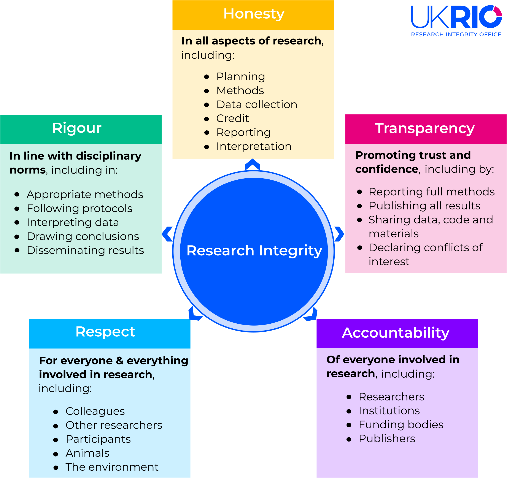

:::::::::::::::::::::::::::::::::::::: questions 

- Why might a paper be retracted?
- How do paper retractions relate to integrity?
- What do we mean by research integrity?

::::::::::::::::::::::::::::::::::::::::::::::::

::::::::::::::::::::::::::::::::::::: objectives

- Describe factors contributing to paper retractions
- Describe components of research integrity
- Explain how lack of integrity could lead to a paper retraction

::::::::::::::::::::::::::::::::::::::::::::::::

## Introducing Alma

Alma has recently joined a new research group as a junior member of the team. They are keen to make a good impression and be
a valued contributor to the team. There has been a lot of buzz around the team and in general about AI, and how they may be helpful in the team's current project. However, Alma isn't so sure. Alma's previous research team lost funding after it was found that the lead investigator had been falsifying data, and a number of papers were retracted. They are also aware of papers in high profile journals being found to have "hallucinated" citations, and concerns around wellbeing. Alma needs some help to critically evaluate if this will be an appropriate tool to use in their research process.

Throughout this lesson we will discuss a range of issues that will help Alma, and you, critically evaluate if an AI tool is appropriate to use in your projects.

## Risks of retraction
In December 2023 Nature reported that more than 10,000 publications had been retracted during that calendar year alone. Publications can be retracted for a number of reasons. Some are retracted by the authors, others by journal editors. Some publications remain in the public conciousness long after they have been retracted. 

An example of this is Wakefield's 1998 article linking autism to MMR vaccines. This article was retracted by the Lancet in February 2010 after it was found that Dr Wakefield and colleagues were found to have acted unethically and that there were concerns about incorrect findings. It was also later discovered that the study was partially funded by lawyers acting for parents who were involved in lawsuits against vaccine manufacturers. The public health impact of this publication has been a reduction in vaccinations, leading to an increase in measles outbreaks, which can be life threatening. 

For details see: [Lancet retracts 12-year-old article linking autism to MMR vaccines](https://pmc.ncbi.nlm.nih.gov/articles/PMC2831678/)

In addition, any articles that have been used in the training data sets for large language models will remain permanently embedded in the model. This can result in incorrect or misleading information being presented to users as facts via model output.

:::::::::::::::::::::::::::::::::::::: callout

### Retraction Watch

[Retraction Watch](https://retractionwatch.com/) is a blog that reports on the retraction of publications from journals and why these have occurred. In addition to the blog posts, there is also the database that stores information about which publications have been retracted, from where and when.

You may want to explore the blog and website, the leaderboards may be of particular interest.

::::::::::::::::::::::::::::::::::::::::::::::::

:::::::::::::::::::::::::::::::::::::: challenge

### What are the risks?
Which of the following could result in a paper being retracted?

1. Hallucinated citations
2. Conflict of interest
3. Falsified data
4. Misleading conclusions

:::::::::::::::::::::::: solution

#### Solution
All of these problems could/should require the paper to be retracted.

:::::::::::::::::::::::::::::::::

::::::::::::::::::::::::::::::::::::::::::::::::

## Research Integrity

Let's consider these two definitions from the Oxford English Dictionary:

Research: Systematic investigation or inquiry aimed at contributing to knowledge of a theory, topic, etc., by careful consideration, observation, or study of a subject.

(https://doi.org/10.1093/OED/1194777451)

Integrity: Soundness of moral principle; the character of uncorrupted virtue, esp. in relation to truth and fair dealing; uprightness, honesty, sincerity.

(https://doi.org/10.1093/OED/1327125083)

What do these mean with regards to how we undertake research?

:::::::::::::::::::::::::::::::::::::: discussion

### Tell Your neighbour: What does research integrity mean to you?

1. Spend 2 minutes thinking about what research integrity means to you
2. Share your understanding of research integrity with your neighbour
3. Was anything different, or unexpected in their understanding?

::::::::::::::::::::::::::::::::::::::::::::::::

The UK Research Integrity Office defines research integrity as all of the factors that underpin good research practice and promote trust and confidence in the research process. These are across the entire research process.

### Dimensions of research integrity

:::::::::::::::::::::::::::::::::::::: spoiler

#### Dimensions 
##### Honesty
In all aspects of research, including:

- Planning
- Methods
- Data collection
- Credit
- Reporting
- Interpretation

##### Transparency
Promoting trust and confidence, including by:

- Reporting full methods
- Publishing all results
- Sharing data, code and materials
- Declaring conflicts of interest

##### Accountability
Of everyone involved in research, including:

- Researchers
- Institutions
- Funding bodies
- Publishers

##### Respect
For everyone & everything involved in research, including:

- Colleagues
- Other researchers
- Participants
- Animals
- The environment

##### Rigour
In line with disciplinary norms, including in:

- Appropriate methods
- Following protocols
- Interpreting data
- Drawing conclusions
- Disseminating

::::::::::::::::::::::::::::::::::::::::::::::::

These five principles sit alongside the four principles defined in [The Singapore Statement](https://wcrif.org/guidance/singapore-statement) agreed at the 2010 World Conference on Research Integrity (WCRI): 

- Honesty in all aspects of research
- Accountability in the conduct of research
- Professional courtesy and fairness in working with others
- Good stewardship of research on behalf of others
  
We will explore each of these dimensions with regards to the use of Generative AI.

## Integrity and retractions

If we know reconsider Wakefield (1998), there were a number of concerns regarding research integerity.

What were the main concerns?

Do these overlap with retraction scenarios?

:::::::::::::::::::::::::::::::::::::: discussion

### Minute Paper: Integrity and retractions

Write for 1 minute on the topic of how a lack of integrity could lead to a paper retraction. 

::::::::::::::::::::::::::::::::::::::::::::::::

::::::::::::::::::::::::::::::::::::: keypoints 

- Papers may be retracted by an author or the journal's editorial team.
- Integrity concerns may be a factor in retraction.
- There are multiple dimensions to integrity.

::::::::::::::::::::::::::::::::::::::::::::::::

[r-markdown]: https://rmarkdown.rstudio.com/
